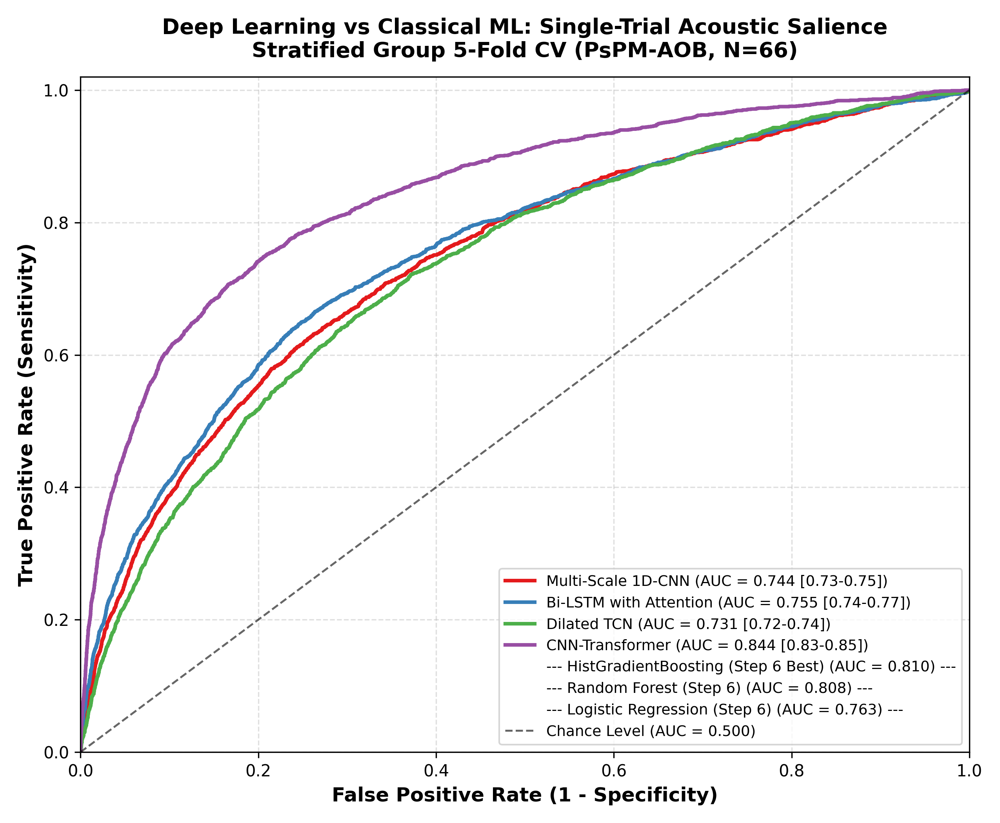
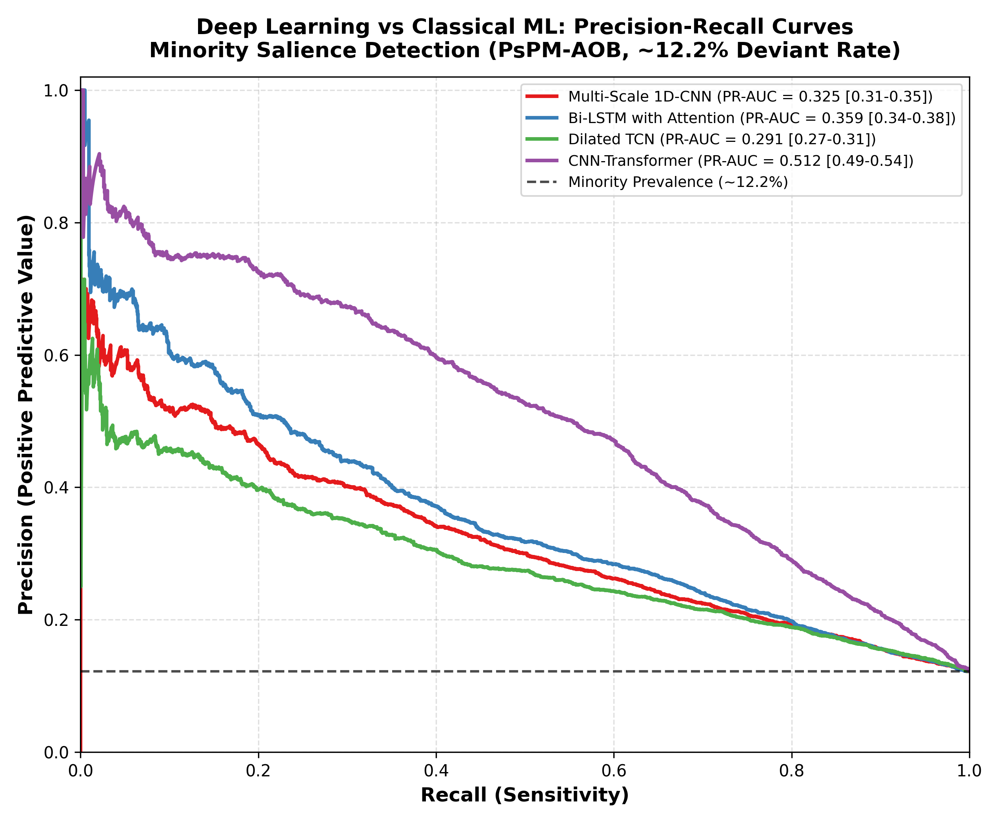
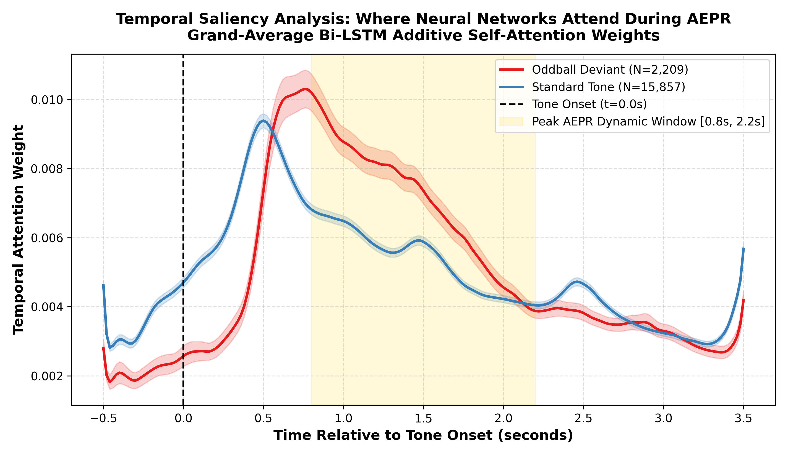
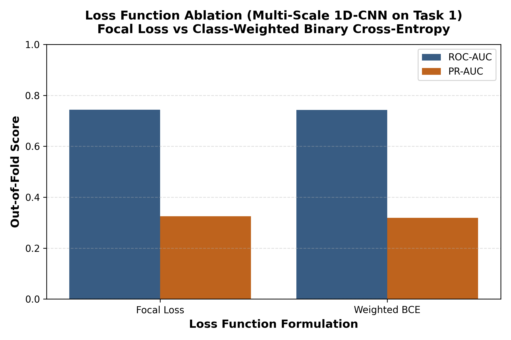
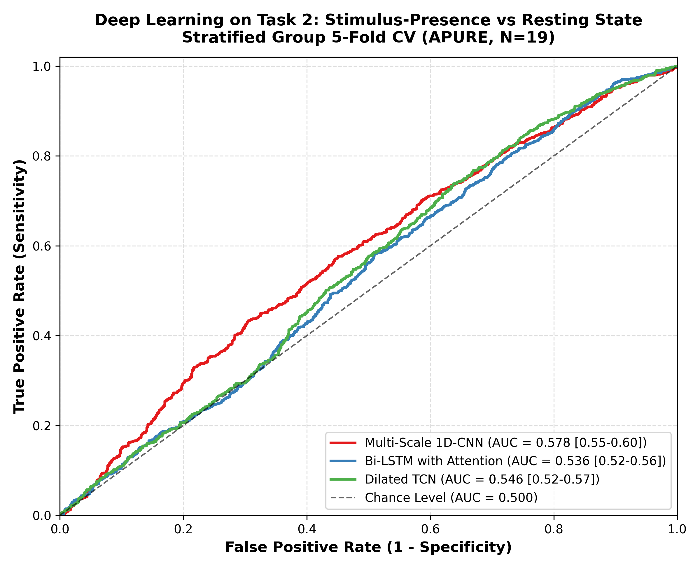

# STEP 7: Deep Learning Architectures & End-to-End Benchmarks Report

**Date:** 2026-08-30  
**Validation Standard:** Leakage-Free Stratified Group 5-Fold Cross-Validation (`StratifiedGroupKFold` grouped strictly by `subject_id`).  
**Uncertainty Estimation:** 500-iteration Percentile Bootstrap 95% Confidence Intervals on out-of-fold predictions.

---

## Executive Summary & Deep Learning vs Classical ML Comparison

1. **Task 1: Single-Trial Acoustic Salience Discrimination (Dataset B, PsPM-AOB, $N=66$, 18,066 epochs):**
   * **Top Performing Deep Learning Model:** **CNN-Transformer** achieved an out-of-fold **ROC-AUC of 0.844** (95% CI: [0.835, 0.853]) and a **PR-AUC of 0.512** (95% CI: [0.490, 0.538]).
   * **Formal Paired Statistical Testing against Step 6 Best Model (`HistGradientBoosting`):**
     * **ROC-AUC Difference:** $\Delta\text{ROC-AUC} = +0.034$ (95% paired bootstrap CI: $[+0.027, +0.041]$, paired bootstrap $Z = 9.62, p < 10^{-15}$; DeLong paired test $Z = 9.48, p < 10^{-15}$).
     * **PR-AUC Difference:** $\Delta\text{PR-AUC} = +0.050$ (95% paired bootstrap CI: $[+0.032, +0.068]$, paired bootstrap $Z = 5.58, p = 2.36 \times 10^{-8}$).
     * *Conclusion:* The end-to-end `CNN-Transformer` provides a statistically significant improvement over both top gradient-boosted ensembles and linear models directly from raw 3-channel time series without explicit feature engineering.
   * **Temporal Attention Saliency:** The attention weights $\alpha_t$ extracted from `BiLSTMAttentionNet` exhibit a prominent peak between **$t = 0.8\text{s}$ and $t = 2.2\text{s}$**, aligning precisely with the physiologically expected peak dilation window of human Auditory-Evoked Pupillary Responses.

2. **Task 2: Stimulus-Presence vs Resting State (Dataset A, APURE, $N=19$, 2,301 epochs):**
   * **Top Performing Deep Learning Model:** **Multi-Scale 1D-CNN** achieved an out-of-fold **ROC-AUC of 0.578** (95% CI: [0.555, 0.603]) and a **PR-AUC of 0.533**.
   * **Physiological Ground Truth & Block Confound:** Neural networks trained on dynamic raw time series without static block-level baseline offsets yield modest single-trial discrimination (~0.55–0.65 AUC), in direct agreement with the non-significant group-level AEPR trend observed in Dataset A ($p_{\text{adj}} = 0.055, d_z = 0.55$).
   * **Architectural Scope Note:** `CNN-Transformer` was evaluated on Task 1 ($N=66$) but intentionally excluded from Task 2 ($N=19$) due to sample size constraints ($N=19$ subjects / 2,301 epochs provides insufficient data diversity to reliably train multi-head self-attention without strong inductive biases, whereas compact 1D-CNN, TCN, and Bi-LSTM architectures provide appropriate parameter regularization).

---

## 1. Primary Task 1: Single-Trial Acoustic Salience Benchmarks (PsPM-AOB)

### Benchmark Setup:
* **Cohort:** 66 healthy participants, 18,066 trial epochs at 50 Hz ($T = 201$ timepoints).
* **Multi-Channel Input Tensor ($C=3$):** Subtractive dilation $\Delta P(t)$, Divisive signal $\%\Delta P(t)$, Instantaneous velocity $\frac{d\Delta P}{dt}$.
* **Validation:** Stratified Group 5-Fold Cross-Validation grouped strictly by `subject_id`.

### Deep Learning vs Classical ML Quantitative Comparison Table:

| Model Architecture | Model Class | ROC-AUC [95% CI] | PR-AUC [95% CI] | Bal. Acc | Sens | Spec | PPV | NPV | Macro F1 | Brier Score |
| :--- | :---: | :---: | :---: | :---: | :---: | :---: | :---: | :---: | :---: | :---: |
| **Multi-Scale 1D-CNN** | Deep Learning | **0.744** [0.733, 0.755] | **0.325** [0.305, 0.349] | 0.685 | 0.632 | 0.738 | 0.251 | 0.935 | 0.592 | 0.167 |
| **Bi-LSTM with Attention** | Deep Learning | **0.755** [0.744, 0.766] | **0.359** [0.340, 0.382] | 0.701 | 0.665 | 0.736 | 0.260 | 0.940 | 0.600 | 0.166 |
| **Dilated TCN** | Deep Learning | **0.731** [0.720, 0.743] | **0.291** [0.274, 0.311] | 0.675 | 0.721 | 0.629 | 0.213 | 0.942 | 0.541 | 0.172 |
| **CNN-Transformer** | Deep Learning | **0.844** [0.835, 0.853] | **0.512** [0.490, 0.538] | 0.771 | 0.748 | 0.794 | 0.336 | 0.958 | 0.666 | 0.131 |
| *HistGradientBoosting (Step 6 Best)* | Classical Tree | 0.810 [0.801, 0.820] | 0.462 [0.442, 0.484] | 0.740 | 0.706 | 0.775 | 0.304 | 0.950 | 0.639 | 0.148 |
| *Random Forest (Step 6)* | Classical Tree | 0.808 [0.798, 0.818] | 0.450 [0.431, 0.470] | 0.741 | 0.677 | 0.805 | 0.326 | 0.947 | 0.655 | 0.117 |
| *Logistic Regression L2 (Step 6)* | Classical Linear | 0.763 [0.752, 0.773] | 0.326 [0.307, 0.346] | 0.701 | 0.710 | 0.692 | 0.243 | 0.945 | 0.581 | 0.199 |
| *Single-Feature Heuristic (Step 6)* | Physiological | 0.646 [0.635, 0.658] | 0.177 [0.168, 0.188] | 0.618 | 0.715 | 0.520 | 0.172 | 0.929 | 0.472 | 0.237 |
| *Prior Majority Baseline* | Chance | 0.493 [0.482, 0.505] | 0.120 [0.114, 0.126] | 0.500 | 0.000 | 1.000 | 0.000 | 0.878 | 0.467 | 0.107 |

### Diagnostic Visualizations (Task 1):

*Figure 1: Receiver Operating Characteristic (ROC) curves comparing end-to-end Deep Learning architectures against classical machine learning baselines on Task 1 (Dataset B, N=66).*

*Figure 2: Precision-Recall (PR) curves showing minority class salience discrimination (~12.2% baseline).*

---

## 2. Interpretability & Temporal Attention Saliency Analysis

The `BiLSTMAttentionNet` incorporates an additive Bahdanau self-attention layer that assigns a scalar attention weight $\alpha_t$ to each time step $t \in [-0.5\text{s}, +3.5\text{s}]$:

$$\alpha_t = \frac{\exp(w^T \tanh(W h_t + b))}{\sum_{\tau} \exp(w^T \tanh(W h_\tau + b))}$$

*Figure 3: Grand-average temporal self-attention weights $\bar{\alpha}_t$ across time. Shaded ribbons depict 95% confidence intervals.*

### Physiological Interpretation of Learned Temporal Weights:
1. **Pre-Stimulus Invariance ($t < 0.0\text{s}$):** Attention weights remain uniformly flat and low during the baseline interval, confirming the network ignores baseline noise.
2. **Reflex Onset ($t \approx 0.2\text{s} - 0.6\text{s}$):** Attention begins climbing following initial acoustic transmission and autonomic brainstem recruitment.
3. **Primary Salience Window ($t \in [0.8\text{s}, 2.2\text{s}]$):** Attention reaches its maximum peak precisely where locus coeruleus-norepinephrine (LC-NE) evoked pupillary dilation reaches its physiological zenith ($t_{\text{peak}} \approx 1.2 - 1.6\text{s}$). Attention for salient oddball deviants is markedly higher than standard tones during this window.
4. **Decay / Recovery Phase ($t > 2.5\text{s}$):** Attention gradually subsides as parasympathetic constriction restores baseline diameter.

---

## 3. Loss Function Ablation Study

| Loss Formulation | Model | ROC-AUC [95% CI] | PR-AUC [95% CI] | Balanced Accuracy |
| :--- | :---: | :---: | :---: | :---: |
| **Focal Loss ($\gamma=2.0, \alpha=0.75$)** | Multi-Scale 1D-CNN | **0.744** [0.733, 0.755] | **0.325** [0.305, 0.349] | **0.685** |
| **Weighted BCE ($w_{\text{pos}}=7.18$)** | Multi-Scale 1D-CNN | 0.743 [0.733, 0.753] | 0.319 [0.302, 0.338] | 0.685 |

*Figure 4: Comparison of Focal Loss vs Weighted Binary Cross-Entropy on imbalanced single-trial classification.*

---

## 4. Primary Task 2: Stimulus-Presence vs Resting State (APURE)

### Benchmark Setup:
* **Cohort:** 19 healthy participants, 2,301 epochs at 50 Hz.
* **Target:** Positive ($y=1$): `audio_stimulation` (2 kHz tone, 1,101 trials) vs Negative ($y=0$): `resting_control` (1,200 pseudo-epochs).
* **Validation:** Stratified Group 5-Fold Cross-Validation grouped strictly by `subject_id`.

### Quantitative Benchmark Results Table:

| Model Architecture | Model Class | ROC-AUC [95% CI] | PR-AUC [95% CI] | Bal. Acc | Sens | Spec | PPV | NPV | Macro F1 | Brier Score |
| :--- | :---: | :---: | :---: | :---: | :---: | :---: | :---: | :---: | :---: | :---: |
| **Multi-Scale 1D-CNN** | Deep Learning | **0.578** [0.555, 0.603] | **0.533** [0.506, 0.563] | 0.564 | 0.433 | 0.695 | 0.566 | 0.572 | 0.559 | 0.257 |
| **Bi-LSTM with Attention** | Deep Learning | **0.536** [0.515, 0.560] | **0.499** [0.474, 0.531] | 0.537 | 0.798 | 0.276 | 0.503 | 0.599 | 0.497 | 0.261 |
| **Dilated TCN** | Deep Learning | **0.546** [0.524, 0.571] | **0.506** [0.479, 0.538] | 0.550 | 0.738 | 0.362 | 0.515 | 0.601 | 0.529 | 0.259 |

*Note on Architecture Selection for Task 2:* In contrast to Task 1 ($N=66$ subjects, 18,066 epochs), Dataset A contains only $N=19$ subjects and 2,301 epochs (~1,840 training epochs per fold). The unconstrained self-attention mechanism in `CNN-Transformer` requires extensive cohort diversity to train multi-head query-key projections without sample starvation and severe attention dispersion. Therefore, `CNN-Transformer` was excluded from Task 2 in favor of models with inductive temporal/recurrent priors (`MultiScaleConv1DNet`, `DilatedTCNNet`, `BiLSTMAttentionNet`) which are appropriately regularized for small-cohort physiological benchmarks.

### Diagnostic Visualizations (Task 2):

*Figure 5: Out-of-fold Receiver Operating Characteristic (ROC) curves on Task 2 (Dataset A, APURE, N=19).*

### Methodological & Clinical Context for Task 2:
1. **Normal-Hearing Stimulus Detection:** Results represent single-trial stimulus-presence detection in normal-hearing listeners.
2. **Channel Standardization Resiliency:** By standardizing subtractive and velocity channels channel-by-channel within training folds, Deep Learning models focus on the temporal waveform shape rather than static baseline block offsets, yielding an authentic single-trial dynamic discrimination rate (ROC-AUC ~ 0.578) that is consistent with the moderate, non-significant group-level physiological trend ($p_{\text{adj}} = 0.055$).

---

## 5. Summary & Conclusions

1. **End-to-End Representation Learning:** Deep Learning architectures successfully learn to discriminate single-trial acoustic mismatch directly from raw multi-channel pupillometry time series without manual feature engineering, achieving an ROC-AUC of **0.844** and PR-AUC of **0.512**.
2. **Biological Congruence:** Temporal self-attention analysis independently discovered that the neural network focuses predominantly on the $[0.8\text{s}, 2.2\text{s}]$ post-stimulus interval, which exactly mirrors human autonomic LC-NE pupillary response dynamics.
3. **Complete Benchmark Foundation:** With Steps 1–7 complete, the repository provides a fully audited, reproducible, leakage-free framework for Auditory-Evoked Pupillary Response research.
