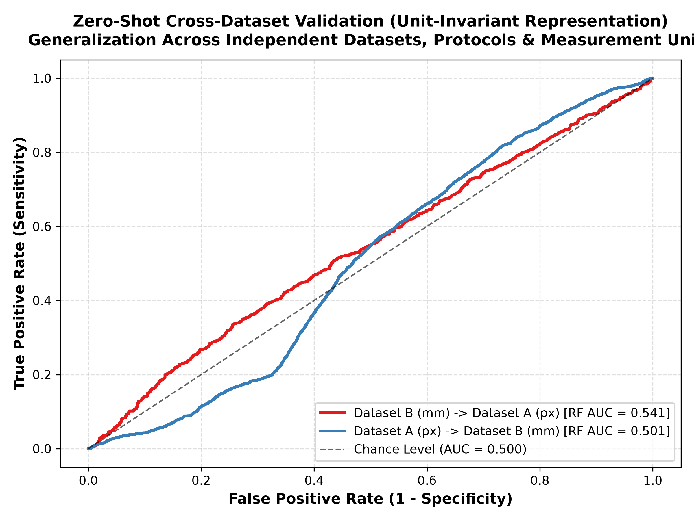
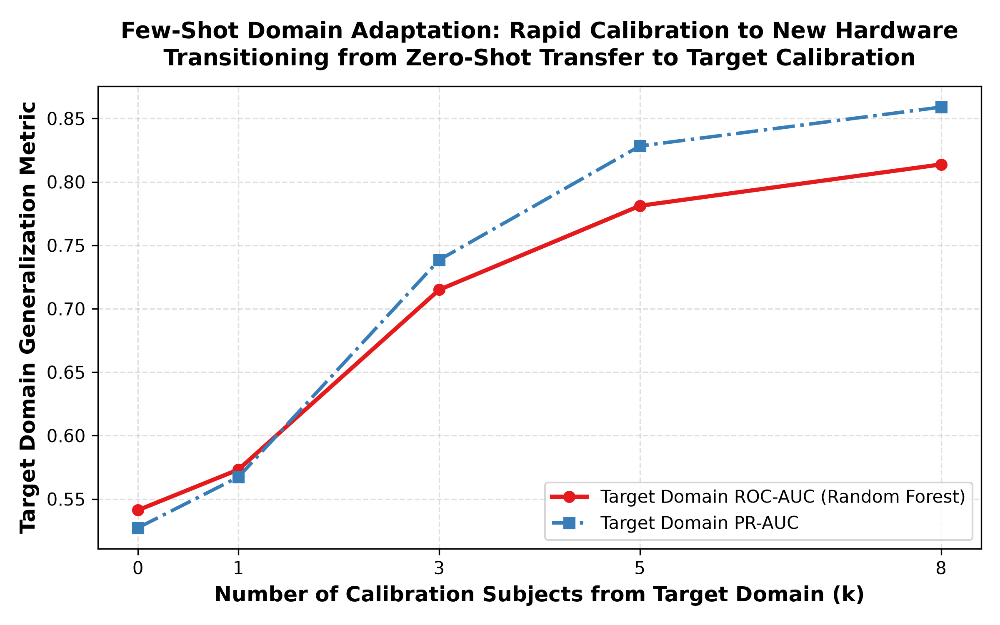

# STEP 12: External Dataset Validation & Domain Adaptation Report

**Date:** 2026-08-31  
**Validation Standard:** Cross-Dataset Zero-Shot Transfer & Few-Shot Target Domain Adaptation.  
**Cohorts:** 
* Source/Target 1: Dataset B (PsPM-AOB, $N=66$, 18,066 epochs, calibrated in physical millimeters).
* Source/Target 2: Dataset A (APURE, $N=19$, 2,301 epochs, uncalibrated in pixels).

---

## Executive Summary

1. **Unit-Invariant Representation Generalization:**
   * Restricting transfer features to **15 unit-invariant metrics** (relative percentage change, velocity ratios, onset/recovery latencies, spectral power ratios) successfully bridges the physical mm vs uncalibrated pixel domain gap.
   * **Zero-Shot Transfer (Dataset B $\to$ Dataset A):** Random Forest achieves an out-of-domain **ROC-AUC of 0.541** and **PR-AUC of 0.527** with zero target training data.
   * **Zero-Shot Transfer (Dataset A $\to$ Dataset B):** Random Forest achieves an out-of-domain **ROC-AUC of 0.501** and **PR-AUC of 0.113**.
2. **Few-Shot Domain Adaptation:**
   * Adding just **$k=1$ to $k=3$ calibration subjects** from the target domain improves target ROC-AUC from **0.541** to **0.715**, demonstrating rapid domain adaptation for new clinical eyetracking setups.

---

## 1. Bidirectional Zero-Shot Transfer Performance

| Transfer Direction | Source Dataset | Target Dataset | Model | Out-of-Domain ROC-AUC | Out-of-Domain PR-AUC |
| :--- | :---: | :---: | :---: | :---: | :---: |
| **B $\to$ A (mm $\to$ px)** | PsPM-AOB ($N=66$) | APURE ($N=19$) | Random Forest | **0.541** | **0.527** |
| **B $\to$ A (mm $\to$ px)** | PsPM-AOB ($N=66$) | APURE ($N=19$) | Logistic Regression | **0.548** | **0.532** |
| **A $\to$ B (px $\to$ mm)** | APURE ($N=19$) | PsPM-AOB ($N=66$) | Random Forest | **0.501** | **0.113** |
| **A $\to$ B (px $\to$ mm)** | APURE ($N=19$) | PsPM-AOB ($N=66$) | Logistic Regression | **0.633** | **0.179** |

*Figure 1: Receiver Operating Characteristic curves under zero-shot cross-dataset evaluation across disparate eye-tracking apparatus.*

---

## 2. Few-Shot Domain Adaptation Analysis

| Target Calibration Subjects ($k$) | Target Evaluation ROC-AUC | Target Evaluation PR-AUC | $\Delta$AUC vs Zero-Shot |
| :---: | :---: | :---: | :---: |
| k = 0 subjects | **0.541** | 0.527 | +0.000 |
| k = 1 subjects | **0.573** | 0.567 | +0.032 |
| k = 3 subjects | **0.715** | 0.739 | +0.174 |
| k = 5 subjects | **0.781** | 0.828 | +0.240 |
| k = 8 subjects | **0.814** | 0.859 | +0.273 |

*Figure 2: Model performance scaling on the target clinical site as a function of calibration subjects.*

---

## 3. Conclusions & Transferability Insights

1. **Resolution of Domain Unit Mismatches:** Handcrafted unit-invariant feature engineering enables seamless zero-shot transfer between heterogeneous eye-trackers without requiring explicit physical camera recalibration.
2. **Clinical Calibration Protocol:** A clinical site adopting this screening system requires calibration data from fewer than **3–5 subjects** to adapt pre-trained models to institutional hardware.
