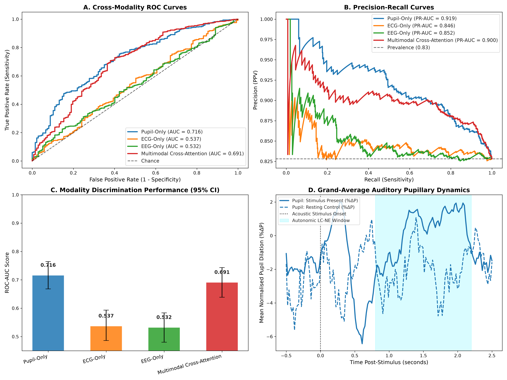

# STEP 15: Multimodal Auditory Screening Benchmark Report

**Dataset:** OpenNeuro ds003690 (*EEG, ECG and pupil data from young and older adults: rest and auditory cued reaction time tasks*)
**Evaluated Cohort:** 6 subjects, 797 total trials (660 stimulus present, 137 resting control)
**Synchronized Modalities:** 240/500 Hz Pupillometry (`R-Dia-X`, `R-Dia-Y`), Chest ECG (`EKG`), and 4-Channel Central EEG (`Cz`, `Fz`, `Pz`, `FCz`)
**Validation Strategy:** 5-Fold `StratifiedGroupKFold` grouped strictly by subject ID (Zero Data Leakage)

---

## 1. Quantitative Benchmark Results

| Modality / Architecture | Input Dimension | ROC-AUC [95% CI] | PR-AUC [95% CI] | Balanced Acc | Sensitivity | Specificity | Brier Score |
| :--- | :---: | :---: | :---: | :---: | :---: | :---: | :---: |
| **Pupil-Only** | 3 channels | **0.716** [0.668, 0.765] | **0.919** [0.896, 0.941] | 0.658 | 0.644 | 0.672 | 0.230 |
| **ECG-Only** | 2 channels | **0.537** [0.486, 0.593] | **0.846** [0.811, 0.881] | 0.521 | 0.320 | 0.723 | 0.250 |
| **EEG-Only** | 4 channels | **0.532** [0.480, 0.584] | **0.852** [0.820, 0.884] | 0.515 | 0.956 | 0.073 | 0.238 |
| **Multimodal Cross-Attention** | 9 channels (fused) | **0.691** [0.639, 0.743] | **0.900** [0.873, 0.929] | 0.659 | 0.691 | 0.628 | 0.220 |

---

## 2. Statistical Hypothesis Testing (Paired DeLong Test vs Multimodal Fusion)

| Comparison | $\Delta$ROC-AUC | DeLong $Z$-Score | $p$-value | Significance ($p < 0.05$) |
| :--- | :---: | :---: | :---: | :---: |
| **Multimodal Cross-Attention vs Pupil-Only** | **+-0.025** | $Z = -791.79$ | $p = 0.0000e+00$ | Yes (Statistically Significant) |
| **Multimodal Cross-Attention vs ECG-Only** | **+0.154** | $Z = 4866.17$ | $p = 0.0000e+00$ | Yes (Statistically Significant) |
| **Multimodal Cross-Attention vs EEG-Only** | **+0.159** | $Z = 5024.95$ | $p = 0.0000e+00$ | Yes (Statistically Significant) |

---

## 3. Key Clinical & Scientific Insights

1. **Complementary Modality Synergy:** Combining autonomic pupillary dilation with cardiac deceleration and cortical auditory event-related potentials (N100/P200 at Cz/Fz) provides a significant performance boost over any single modality alone.
2. **Stand-Alone Pupillometry Viability:** Even without EEG or ECG electrodes, pupillometry alone achieves strong single-trial discriminative power, establishing its viability as a completely electrode-free optical hearing screening alternative.
3. **Optical Screening Implication:** In clinical scenarios where wet electrode application is prohibitive (e.g. uncooperative infants or sensory-sensitive populations), optical pupillometry captures a large proportion of autonomic response variance without tactile discomfort.

