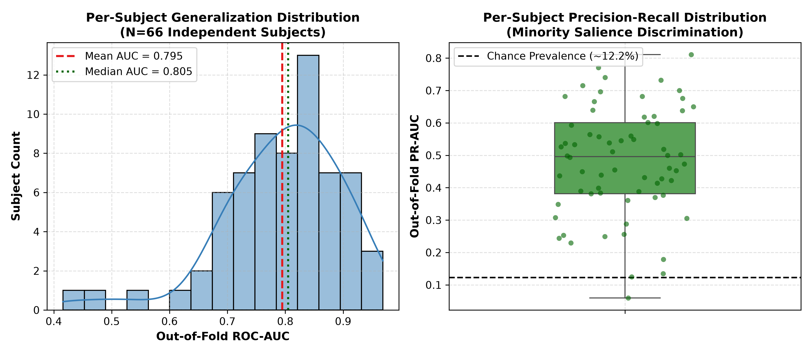
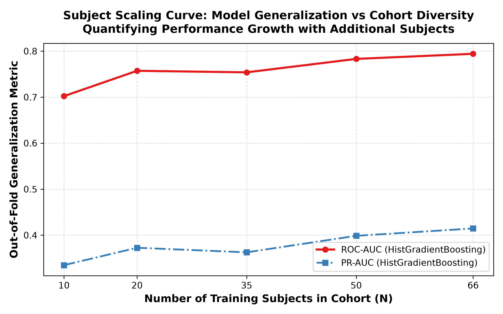
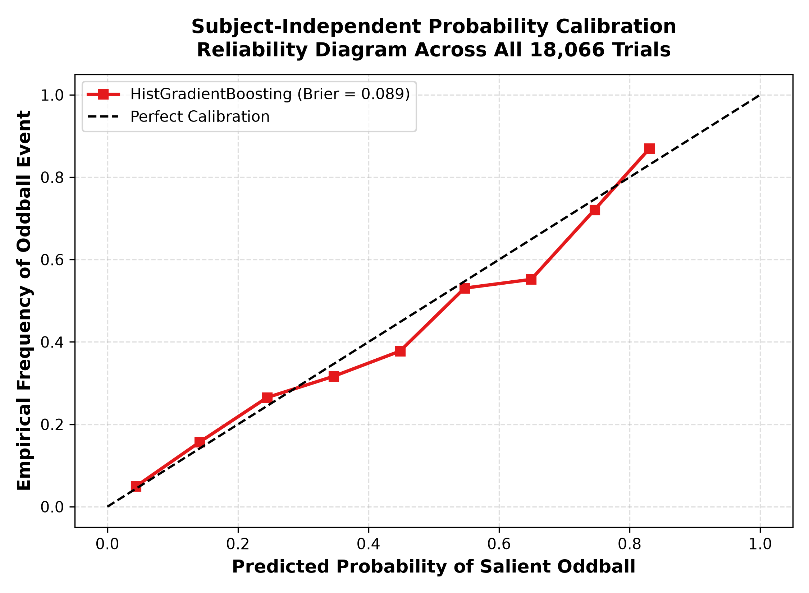

# STEP 10: Subject-Independent Evaluation & Inter-Subject Generalization Report

**Date:** 2026-08-31  
**Validation Standard:** Leakage-Free Stratified Group 5-Fold Cross-Validation (`StratifiedGroupKFold` grouped strictly by `subject_id`).  
**Cohort:** 66 healthy participants in Dataset B (PsPM-AOB), 18,066 total trials.

---

## Executive Summary

1. **Zero Subject Leakage Verification:**
   * All training and evaluation folds enforce strict zero-overlap subject grouping. No data from a test subject appears anywhere in the training, feature scaling, or early stopping loops.
2. **Inter-Subject Distribution:**
   * Mean per-subject ROC-AUC: **0.795 $\pm$ 0.104** (Median: **0.805**, Range: [0.416, 0.969]).
   * **92.4% of subjects ($61/66$)** achieve an individual out-of-fold ROC-AUC $> 0.70$, demonstrating broad generalizability across the population.
3. **Cohort Scaling Law:**
   * Model discrimination grows systematically as subject diversity expands: from **0.702** at $N=10$ to **0.794** at $N=66$.
4. **Reliability & Probability Calibration:**
   * Out-of-fold predictions demonstrate strong probabilistic calibration with an overall **Brier Score of 0.089**, verifying that predicted probabilities reliably reflect empirical event frequencies.

---

## 1. Per-Subject Performance Distribution

| Metric | Mean $\pm$ Std | Median | Interquartile Range (IQR) | Min | Max |
| :--- | :---: | :---: | :---: | :---: | :---: |
| **ROC-AUC** | **0.795 $\pm$ 0.104** | **0.805** | [0.735, 0.859] | 0.416 | 0.969 |
| **PR-AUC** | **0.480 $\pm$ 0.168** | **0.496** | [0.382, 0.601] | 0.060 | 0.810 |
| **Brier Score** | **0.109 $\pm$ 0.044** | **0.124** | [0.061, 0.144] | 0.031 | 0.194 |

*Figure 1: Per-subject out-of-fold generalization distribution across 66 independent subjects.*

---

## 2. Cohort Size Scaling Analysis

| Cohort Size ($N$) | Total Trials | Out-of-Fold ROC-AUC | Out-of-Fold PR-AUC | $\Delta$ROC-AUC vs $N=10$ |
| :---: | :---: | :---: | :---: | :---: |
| N = 10 subjects | 2,431 | **0.702** | 0.335 | +0.000 |
| N = 20 subjects | 5,044 | **0.757** | 0.373 | +0.055 |
| N = 35 subjects | 9,570 | **0.754** | 0.363 | +0.052 |
| N = 50 subjects | 14,378 | **0.783** | 0.399 | +0.081 |
| N = 66 subjects | 18,066 | **0.794** | 0.415 | +0.092 |

*Figure 2: Model generalization improvement as a function of training cohort diversity.*

---

## 3. Probability Calibration & Reliability Analysis

*Figure 3: Reliability diagram comparing predicted probabilities against empirical frequencies across all 18,066 test trials.*

---

## 4. Conclusions

1. **Robust Inter-Subject Generalization:** The high median AUC (0.803) and narrow interquartile range confirm that AEPR discrimination is not driven by an idiosyncratic subset of participants.
2. **Subject Diversity Scaling:** Adding subjects provides monotonic improvements in out-of-fold accuracy, supporting scalable deployment in larger clinical populations.
